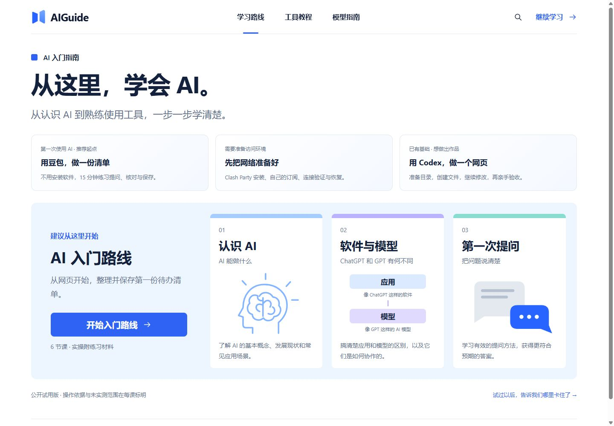
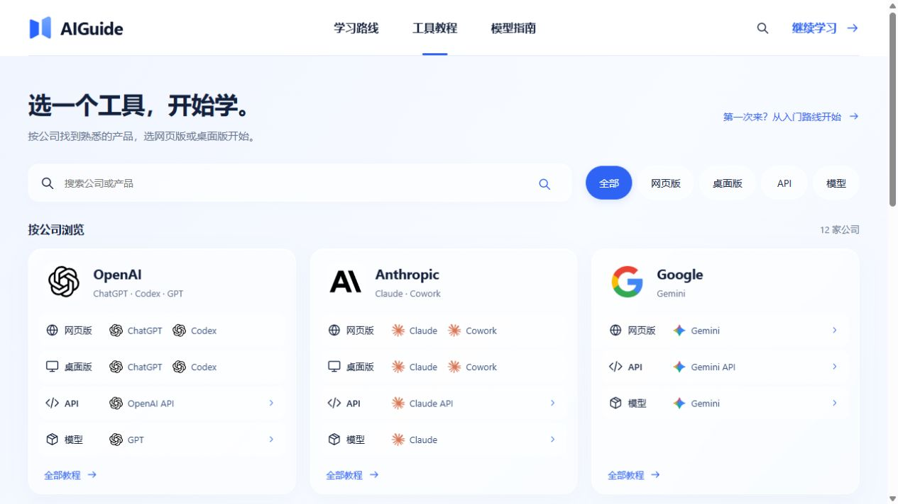
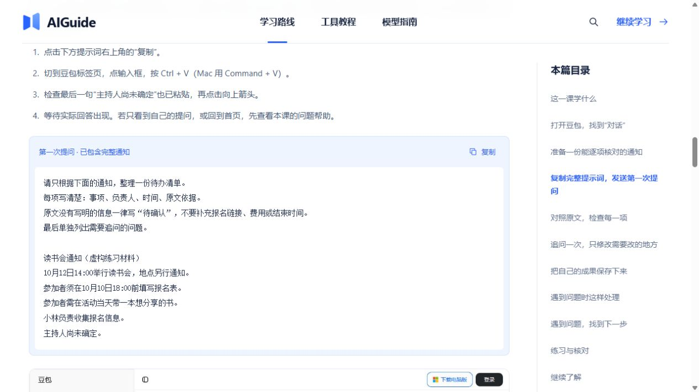
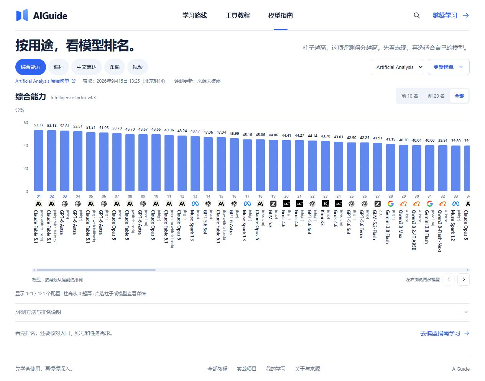

<p align="center">
  
</p>

<h1 align="center">AIGuide</h1>

<p align="center"><strong>AI 学习手册 · 从这里，学会 AI。</strong></p>
<p align="center">面向中文读者，从认识 AI 到完成第一个作品。</p>

<p align="center">
  <a href="https://github.com/Yueyuyu/ai-guide/actions/workflows/ci.yml"></a>
  <a href="LICENSE"></a>
  <a href="package.json"></a>
  <a href="package.json"></a>
  <a href="CONTRIBUTING.md"></a>
</p>

<p align="center">
  <a href="https://ai-guide.yomexa.com/">在线体验</a> ·
  <a href="#网站预览">网站预览</a> ·
  <a href="#快速开始">本地运行</a> ·
  <a href="docs/README.md">工程文档</a> ·
  <a href="docs/ROADMAP.md">迭代计划</a> ·
  <a href="https://github.com/Yueyuyu/ai-guide/issues/new/choose">反馈与纠错</a>
</p>

按路线完成一件小事，按公司找到产品，分清应用、模型与 API，再把练习成果保存下来。**先学会使用，再慢慢深入。**

> 当前版本 **0.1.0**，公开试用版：[在线体验](https://ai-guide.yomexa.com/) · [参加试用](https://ai-guide.yomexa.com/#/feedback)。部分教程仍待账号内实测；具体范围见[项目状态](docs/STATUS.md)。

## 网站预览

**首页：给第一次学习 AI 的人一个明确起点。**



| 按公司找到产品 | 跟着教程完成练习 |
| --- | --- |
|  |  |
| 保留品牌原色，按四类入口组织教程。 | 学习步骤、原文与核对方法放在一起。 |

<details>
<summary><strong>查看模型排名页面</strong> · 分数、配置、来源与日期</summary>



</details>

以上为 **2026-09-15 本地生产构建的实际页面截图**，可点击查看原图。榜单图片是一份时间明确的快照；课程中的产品账号实测状态以正文标注为准。截图与维护说明见[预览资产说明](docs/readme/README.md)。

## 适合谁

| 你现在的起点 | 推荐从哪里开始 | 练习目标 |
| --- | --- | --- |
| 需要准备工具访问环境 | 网络准备 → Clash Party | 分清客户端与订阅，记录导入、连接与恢复检查 |
| 第一次接触 AI | AI 入门路线 → 豆包网页版 | 根据一段通知整理并核对待办清单，保存为 TXT |
| 已经会使用 AI，想尝试编程 | AI 编程路线 → Codex 桌面 | 创建一个个人网页，再进行修改与验收 |
| 想理解工具背后的能力 | 模型指南 → 模型排名 → API 基础 | 分清软件、模型与接口，学会比较和核对 |

每条路线先说明设备、账号、访问条件与费用。不同产品提供不同操作教程；准备好对应环境后，再进入实操。

## 在这里可以学什么

| 板块 | 已实现 |
| --- | --- |
| 学习路线 | 网络准备、AI 入门、AI 编程、办公提效、模型接入；前置设备、账号、费用和成果说明 |
| 工具教程 | 12 家公司、31 个产品与模型入口，按网页版、桌面版、API、模型组织 |
| 教程实操 | 45 篇教程；网络准备、豆包网页与 Codex 桌面主线提供材料、中文步骤、核对与问题帮助 |
| 我的学习 | 阅读位置、收藏、自查、项目进度和 9 篇成果草稿；JSON 备份与 TXT 导出 |
| 试用反馈 | 三条主线任务、公开内容预览、GitHub Issue 提交与本地留存 |
| 模型排名 | Artificial Analysis 综合能力与终端编程快照，保留来源、指标与日期 |
| 独立阅读 | 45 篇独立 HTML 教程及阅读目录，无需 JavaScript 即可阅读正文与来源 |

教程数量不代表实操覆盖率。人工参考答案、教学示意、官网截图和实际操作证据分别标识。本站没有在线 AI 对话、账号同步或付费服务。

## 快速开始

使用 **Node.js 24 LTS** 和 **pnpm 11.19.0**。版本见 [.node-version](.node-version) 与 [package.json](package.json)。本地启动无需密钥、数据库或环境变量。

```sh
git clone https://github.com/Yueyuyu/ai-guide.git
cd ai-guide
npm install --global pnpm@11.19.0
pnpm install --frozen-lockfile
pnpm dev
```

打开 [http://127.0.0.1:4186/](http://127.0.0.1:4186/)。请通过开发服务访问，直接双击源码 `index.html` 不能运行 JSX。

首次拉取后运行完整检查：

```sh
pnpm check
```

这个命令依次运行测试、站内内容审计、工程文档检查和生产构建，失败即停止；不会刷新外部榜单或推送代码。

## 常见问题

**需要 API Key 或数据库吗？** 本地运行本站不需要。学习第三方产品时，其登录、额度、费用和访问条件以对应产品为准。

**学习记录保存在哪里？** 收藏、阅读位置、自查与草稿保存在当前浏览器，可导出 JSON 备份。当前没有账号同步，换设备前先导出。

**模型排名会实时更新吗？** 页面显示有来源与获取日期的快照。维护者可手动刷新；当前纯静态部署不具备定时更新服务。

## 一起完善 AIGuide

欢迎从一个小问题开始参与，写代码和修正文案都很有价值：

- **教程入口变了、步骤对不上**：[提交教程纠错](https://github.com/Yueyuyu/ai-guide/issues/new?template=content_correction.yml)，附产品版本、日期或官方来源。
- **页面、导航或下载出现问题**：[提交功能问题](https://github.com/Yueyuyu/ai-guide/issues/new?template=bug_report.yml)，说明复现步骤。
- **想改进代码或内容**：先读[贡献说明](CONTRIBUTING.md)和[迭代计划](docs/ROADMAP.md)，再提交 PR。

当前优先补齐豆包与 Codex 的账号内实操、新手试用记录及待核对教程。发布反馈前请移除账号、密钥和私人对话。

<details>
<summary><strong>开发与维护</strong> · 常用命令、联网审计与工程结构</summary>

### 常用命令

| 命令 | 用途 |
| --- | --- |
| `pnpm dev` | 本地开发，默认 `127.0.0.1:4186` |
| `pnpm test` | Node 内置测试，无需外部账号 |
| `pnpm audit:content` | 检查教程、路线、章节与练习资源 |
| `pnpm audit:docs` | 检查维护文档中的本地链接及机器专属路径 |
| `pnpm check` | 测试 → 内容审计 → 文档审计 → 构建 |
| `pnpm resources` | 从内容源生成六份中文 TXT 材料 |
| `pnpm refresh:rankings` | 联网刷新榜单，失败保留有效快照 |
| `pnpm build` | 生成 `dist/`，含互动站与独立阅读页 |
| `pnpm preview --port 4190` | 在独立端口检查生产构建 |

外链检查独立于默认 CI：

```sh
pnpm audit:content --links --output .local/content-audit.json
```

Windows 上 Node 网络受限时增加 `--system-http`，使用系统 PowerShell 网络方式。403、限流、超时不会直接判成失效。详见[内容维护](docs/engineering/CONTENT.md)。

### 工程结构

```text
src/
  pages/          页面与路由视图
  components/     导航、教程、图表和交互组件
  data/           课程、产品、公司、练习与来源登记
  lib/            学习记录、筛选、排名校验和维护规则
  styles*.css     共享与分页面样式
server/           Vite 插件、阅读页生成、榜单获取与存储
scripts/          材料生成、审计和项目检查
public/           品牌资产、教程证据、练习文件和榜单快照
tests/            Node 测试与小型测试数据
docs/             工程文档、内容证据和历史设计资料
.github/          CI、Issue 模板和 PR 模板
```

`server/` 是构建工具和本地开发／预览中间件，不是已部署的业务后端。数据流、路由和存储约定见[架构说明](docs/engineering/ARCHITECTURE.md)。

</details>

## 文档导航

| 我要做什么 | 文档 |
| --- | --- |
| 找到模块和数据流 | [文档目录](docs/README.md)、[架构说明](docs/engineering/ARCHITECTURE.md) |
| 配置环境、运行与排错 | [开发指南](docs/engineering/DEVELOPMENT.md) |
| 增加教程、产品、材料或截图 | [内容维护规范](docs/engineering/CONTENT.md) |
| 刷新或扩展榜单 | [排名数据维护](docs/engineering/RANKINGS.md) |
| 回归与实测 | [质量与验收](docs/engineering/QUALITY.md) |
| 独立建仓、推送和发布 | [GitHub 与发布指南](docs/engineering/RELEASE.md) |
| 安排后续工作 | [迭代计划](docs/ROADMAP.md) |
| 提交修改、让 AI 继续维护 | [贡献说明](CONTRIBUTING.md)、[项目规则](AGENTS.md) |
| 核对视觉与资料 | [当前设计](docs/DESIGN.md)、[来源审计](docs/SOURCE-AUDIT.md)、[资产说明](docs/ASSETS.md) |

## 构建与发布

发布目录为 `dist/`，独立阅读入口为 `/read/index.html`，互动入口为 `/#/`。相对资源路径支持子目录部署。

确定正式 HTTPS 地址后，将 [.env.example](.env.example) 复制为 `.env.local`，填写 `AIGUIDE_SITE_URL`，再运行 `pnpm build`。有效地址用于生成 canonical、Open Graph 地址、`sitemap.xml` 和 `robots.txt`；未配置时不会写入虚构域名。

GitHub CI 在 Linux／Windows 检查工程；主分支的[发布工作流](.github/workflows/pages.yml)检查后将 `dist/` 部署到 GitHub Pages。榜单不自动刷新。部署结果与回退见[发布指南](docs/engineering/RELEASE.md)。

## 记录、来源与使用边界

- 学习记录使用当前浏览器的 `zhixing-ai-learning-v1`，保留旧键名兼容历史记录；切换浏览器或站点来源不会自动同步。
- JSON 导入合并有效记录，同课已有草稿优先保留；清除网站数据前先备份。
- 内容整理日期、资料核对日期和榜单获取日期不能代替账号实测或评测日期。
- 纯静态网站显示构建快照，没有后台定时刷新。
- 反馈可预览后到 GitHub 提交公开 Issue，需要 GitHub 登录；复制或下载不代表已经提交。
- Cloudflare Web Analytics 接入按[反馈与统计说明](docs/engineering/FEEDBACK.md)配置；没有有效 token 时不加载统计脚本。当前配置及接收验证状态见[项目状态](docs/STATUS.md)。
- 原创代码、文档和练习材料采用 [MIT License](LICENSE) 开源。第三方依赖、标识、资料、截图和榜单数据遵循各自条件，见 [NOTICE.md](NOTICE.md)。
