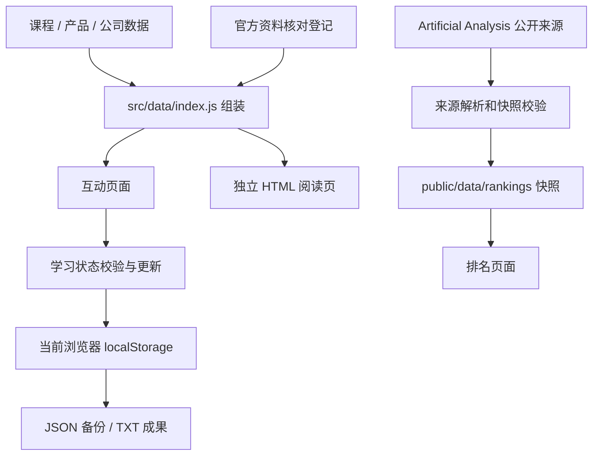

# 架构说明

## 技术选择

React 19 负责界面，Vite 7 负责开发和静态构建，JavaScript ESM 组织业务逻辑，CSS 负责视觉。测试使用 Node 内置运行器。精确依赖版本以 [pnpm-lock.yaml](../../pnpm-lock.yaml) 为准。

当前没有独立业务 API 服务、数据库、认证系统或在线模型调用。新增后端应围绕具体需求单独设计，不把本地 Vite 中间件直接视作生产后端。

## 数据流

## 模块职责

| 位置 | 职责 | 修改时同时检查 |
| --- | --- | --- |
| `src/App.jsx` | 路由到页面、标题、按需加载 | 新页面入口与标题 |
| `src/lib/hooks.jsx` | 学习上下文、路由、位置恢复、复制 | 存储失败、切页和键盘行为 |
| `src/lib/learning.js` | 状态正规化、进度、自查、查询参数 | 老备份兼容和无效数据 |
| `src/data/index.js` | 课程最终组装与来源关联 | 同 ID 的后置覆盖 |
| `src/data/catalog.js` | 路线顺序、项目与基础目录 | 下一课、选学和进度计算 |
| `src/data/products.js`、`companies.js` | 产品入口、公司归属、品牌 | 网页／桌面／API／模型区分 |
| `src/data/source-review.json` | 资料获取证据和产品核对范围 | 日期、哈希、未覆盖项 |
| `src/data/manual-catalog.js`、`src/data/manuals/` | 使用手册目录、本站正文与官方来源 | 产品别名搜索、章节深链、核对与实测边界 |
| `src/pages/Manuals.jsx`、`server/manual-pages.js` | 手册互动版与独立阅读版 | 双入口、正文一致、复制、窄屏与来源 |
| `server/reading-*.js` | 独立正文、元信息与构建输出 | HTML 转义、相对路径和来源 |
| `server/ranking-*.js` | 榜单获取、校验、存储、本地接口 | 失败保留、并发、来源变化 |

## 路由

互动站采用 Hash 路由，状态由 `parseRoute` 和 `useRoute` 解析。链接中的查询条件属于 Hash 后的内容。

| 路径示例 | 作用 |
| --- | --- |
| `/#/` | 首页 |
| `/#/path/starter` | 路线详情 |
| `/#/learn/doubao-notice?path=starter` | 带路线上下文的教程 |
| `/#/learn/doubao-notice?section=section-5` | 定位成果章节 |
| `/#/tools`、`/#/company/openai` | 工具目录、公司专题 |
| `/#/models`、`/#/ranking` | 模型学习与榜单 |
| `/#/manuals`、`/#/manuals/zcode?section=workspace` | 使用手册目录及章节深链 |
| `/manuals/index.html`、`/manuals/zcode.html` | 无脚本手册目录与完整正文 |
| `/#/library?tab=drafts` | 我的成果 |
| `/read/index.html` | 独立阅读目录 |
| `/read/doubao-notice.html` | 可直接取得正文的独立页面 |

独立页不使用另一套课程文案。Vite 开发中间件即时生成，构建插件写入 `dist/read/`。交互练习返回同源的 Hash 页面，因此不丢失原有本地记录。

使用手册同样由 `reading-plugin` 在开发模式生成并在构建时写入 `dist/manuals/`，纳入 sitemap。目录元数据用于全站搜索和标题，正文随页面按需加载。新手册尚未接入每周资料变化检查；正文不计入旧课程学习状态，不修改原有课程 ID。

每份手册保留原五节，扩展内容放在 `src/data/manuals/*-workflows.js`，由 `manuals/index.js` 合并来源与章节。`kind` 统一驱动分类入口，`faq` 使用原生折叠，`caseStudy` 区分已有实测和教学练习。资源链接经 `manualResourceHref` 转为互动课程深链、独立阅读章节或带部署前缀的公开文件路径。`public/practice/manuals/` 存放故意保留缺陷的起始材料；它们不属于站点运行逻辑，也不纳入默认通过型测试集合。

## 学习状态约定

存储键保持 `zhixing-ai-learning-v1`，结构版本保持 `1`。品牌名称变化不代表应当更换存储键。

主要字段：`saved` 收藏，`completed` 已完成，`exercises` 自查，`history` 阅读历史，`contexts` 路线上下文，`locations` 章节位置，`projectChecks`／`projectCompleted` 项目进度，`drafts` 成果。

- 仅接受当前目录中存在的课程与合法章节；草稿只允许有 `resultSaving` 的课，最多 12,000 字。
- 完成课程需自查全部勾选；仅阅读、填草稿、点击下载不会自动完成。
- 取消自查项会撤销对应完成状态；选学不计入主线进度。
- 导入合并记录，同课已有草稿优先。修改结构时先设计迁移，再修改版本。
- 原始数据损坏时停止自动覆盖，提供备份和恢复出口。
- `localhost`、`127.0.0.1`、不同端口、正式域名属于不同来源，记录不自动共享。

## 内容组装顺序

基础课程数组 → `entryGuides` 入口说明 → 封面调整 → 入门覆盖 → 实操覆盖 → 学习帮助 → 来源计算。直接改基础课可能被后置配置覆盖；先查看 `lessonById[id]` 的最终数据。

现有课程 ID 和 `section-N` 被书签与本地记录引用。优先补充章节内容；插入、删除或重排章节前处理阅读位置兼容。

## 构建边界

`public/` 会复制到 `dist/`，所以其中只放允许随网站公开的内容。`.env.local` 里的正式站点地址只由构建读取；不要使用 `VITE_` 前缀承载秘密。

前端首屏与独立 HTML 的搜索可见性不同。独立页已有正文、标题和摘要；canonical／站点地图需要正式地址。代码生成这些标签不等于搜索引擎已经收录。
