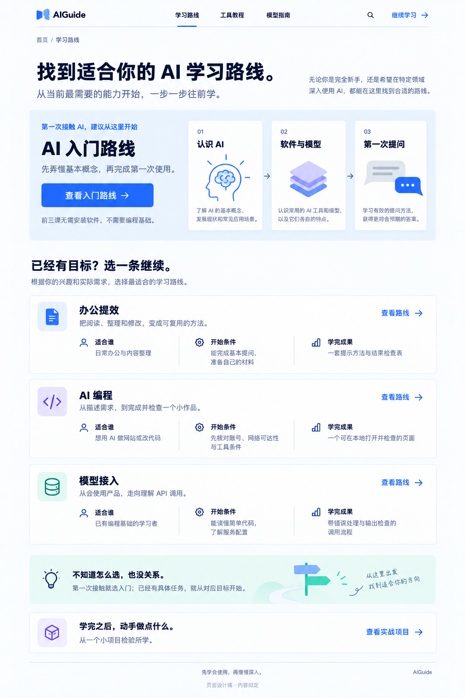
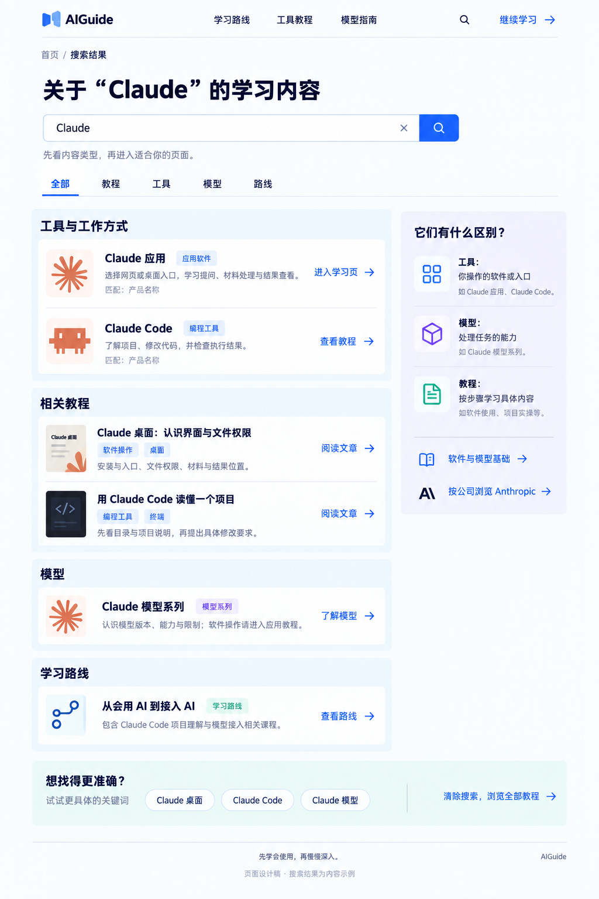
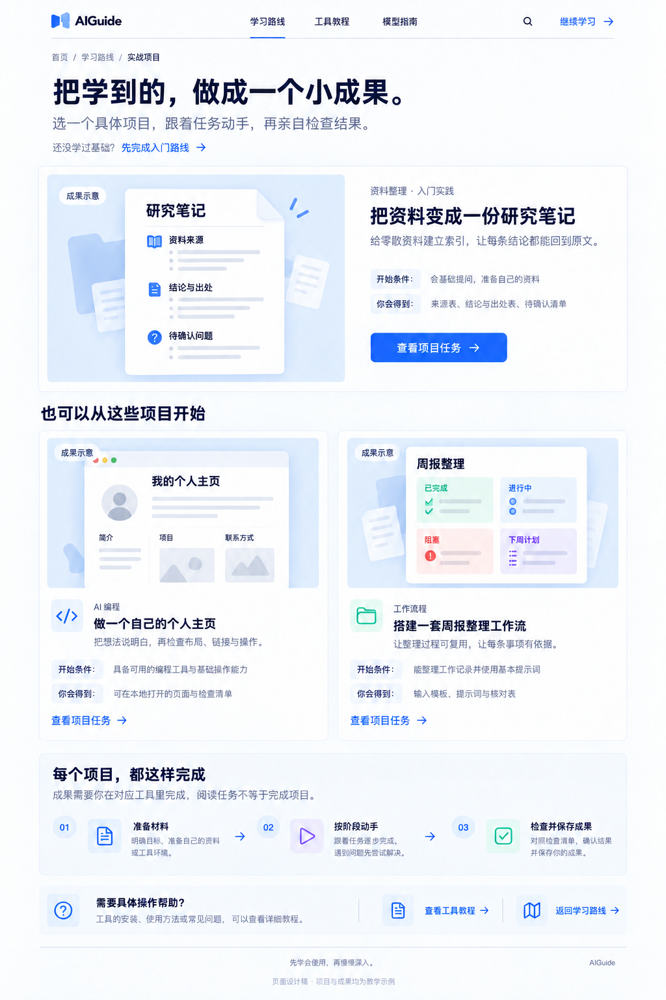
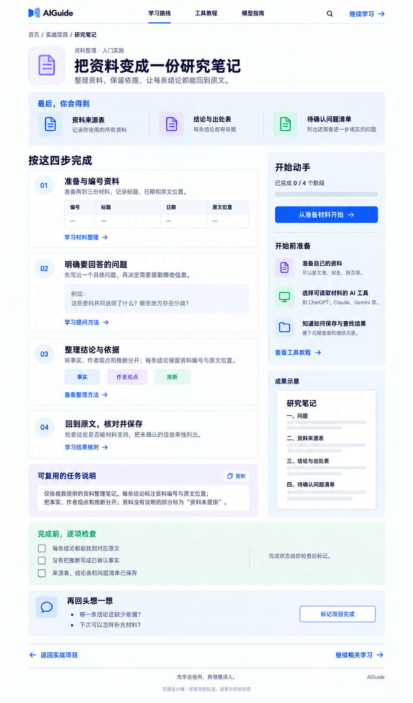
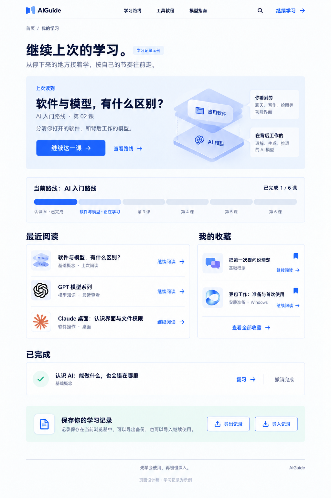

# AIGuide 第四批桌面内页 UI V1

日期：2026-09-14。

本批补齐内容蓝图中最后五种主页面的桌面稿：路线总览、搜索结果、实战项目总览、项目任务页和我的学习。使用内置 image_gen，保持已选首页与前几批内页的视觉风格。

## 01 学习路线总览

[查看完整原图](aiguide-paths-overview-v1.png)

首屏明确推荐 AI 入门路线，其他路线按办公提效、AI 编程与模型接入分别列出适用对象、开始条件和学完成果。入门路线与首页及六课路线详情一致；不把所有新手都默认带入需要额外条件的编程工具。

## 02 搜索结果

[查看完整原图](aiguide-search-results-v1.png)

以 Claude 为查询示例，将工具、教程、模型和路线分组。每条结果显示内容类别与去向，区别于只搜索教程的课程目录。关键词建议是帮助缩小查询范围，不代表真实热门搜索统计。

第一次生成遇到图片服务连接失败，检查生成目录无新文件后使用相同内置工具重试成功，未切换 CLI 或 API。

## 03 实战项目总览

[查看完整原图](aiguide-projects-overview-v2.png)

采用当前内容库已有的研究笔记、个人主页与周报工作流三个题材。先展示教学成果示意，再说明准备条件和交付物，按钮进入项目任务。作品示意不表示已有真实研究结果、个人资料或实际周报成果。

项目类别使用通用功能图标，具体产品才使用品牌标识。初稿的“AI 编程”分类误用了终端工具图标，因此另存 V2 进行局部修正；保留 V1 原稿。

## 04 项目任务页

[查看完整原图](aiguide-project-research-task-v1.png)

以研究笔记为例，把任务拆成准备资料、明确问题、整理结论、核对保存四个阶段。提供对应教程、可复用任务说明和验收清单。默认进度为 0 / 4；阅读任务不等于完成项目，完成状态需要用户自行检查后标记。

## 05 我的学习

[查看完整原图](aiguide-my-learning-v1.png)

优先展示继续上次课程，下面是当前路线、最近阅读、收藏和已完成内容。1 / 6 进度为设计示例，不来自用户真实记录。记录管理沿用当前浏览器本地保存的方向，提供导入、导出入口，不设计尚不存在的云同步或账号权益。

## 范围与后续

本批是完整桌面主页面的静态视觉设计，不是运行中的网站。未修改网站源码，未核实第三方软件的当前操作条件，也未执行浏览器交互或手机适配验收。

主页面出稿后，仍需补齐手机布局、空状态、筛选与展开等交互状态，再实现网站并做真实浏览器验证。

[全站设计目录](design-index.md) · [实际生成提示词](aiguide-completion-pages-v1-20260914.prompt.md) · [全站内容蓝图](site-content-blueprint-v1.md)

## 原始生成记录

原始目录：`C:/Users/Yueyu/.codex/generated_images/01a076fd-b82f-74e1-a6b6-61ef9d5188bd/`。项目内保存独立副本，原始生成文件保留。

- 路线总览：`exec-e64455e2-fccf-4bee-bc63-df60692c3829.png`，1024 × 1536。
- 搜索结果：`exec-f3f7baec-be62-4038-ab45-cb0cc73016d6.png`，1024 × 1536。
- 项目列表初稿：`exec-b3fb8329-9db2-4966-9d0b-3900818f6534.png`，1024 × 1536。
- 项目任务页：`exec-e5e43010-6878-4a9f-9f32-a03ac4c93641.png`，962 × 1635。
- 我的学习：`exec-b0c68e6b-2d77-42ed-8708-f07196a8e724.png`，1024 × 1536。
- 项目列表修正版 V2：`exec-29404ce5-6f93-48b0-914b-971431c0143b.png`，1024 × 1536。

五种页面已完成主要文字、内容分组、首尾布局与示例进度的一致性目视检查；项目列表的分类图标已改为通用代码符号。全站设计目录中的 15 张主页面图片及本批文档的本地链接均存在。以上是静态资产检查，不是网站功能测试。
