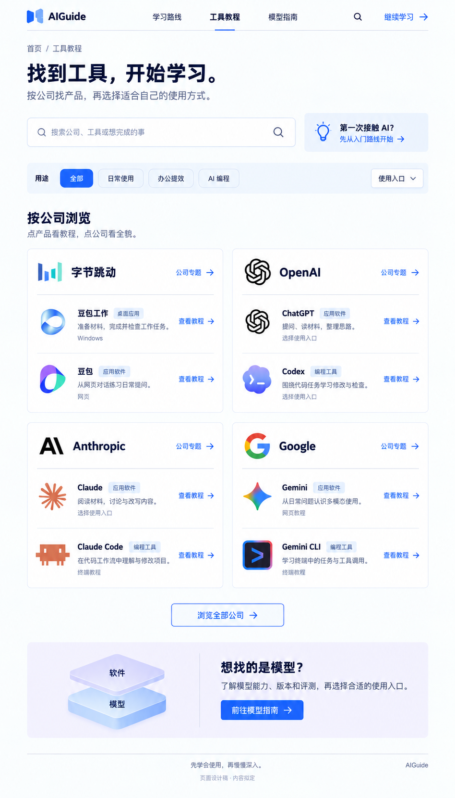
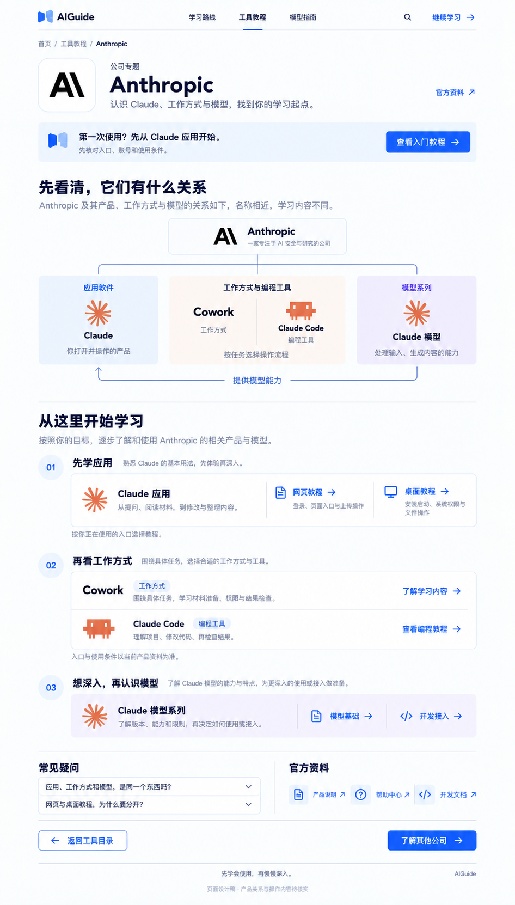
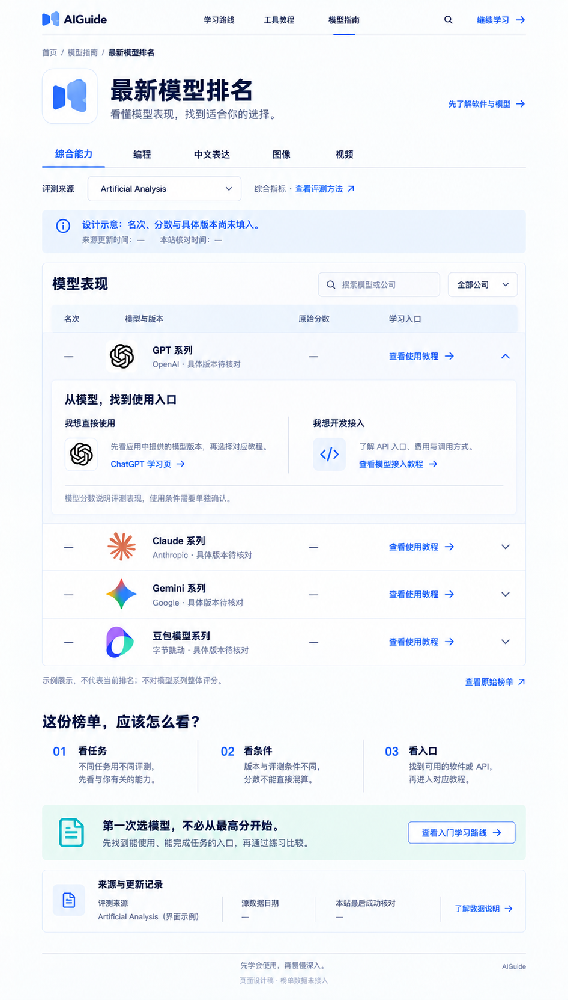

# AIGuide 第二批内页 UI V1

日期：2026-09-13。

按用户指定顺序制作工具目录、公司专题、模型排名三张完整桌面静态稿。生成方式为内置 image_gen，延续前一批内页的蓝白背景、书页 Logo 与中文内容层次。

## 01 工具目录

[查看完整原图](aiguide-tool-directory-v1.png)

搜索与用途筛选在上方，下方用四个公司分组展示产品：字节跳动、OpenAI、Anthropic、Google。公司入口解释整体关系，产品入口直接进入教程。桌面应用、应用软件、编程工具用文字区分，各品牌保持自己的图形和配色。

此图是部分公司目录的展示样例，不表示全站只有四家公司。产品使用条件与详细教程仍应根据实际入口维护。

## 02 公司专题

[查看完整原图](aiguide-company-anthropic-v1.png)

以 Anthropic 为例，先用关系图区分 Claude 应用、Cowork 工作方式、Claude Code 编程工具与 Claude 模型，再分别连接应用、工作方式和模型的学习内容。应用区进一步区分网页与桌面教程。

Anthropic 公司使用黑色公司标识，Claude 产品系列使用橙色星芒；Cowork 以文字和类别标签呈现，不虚构专用图标。此图不对安装程序合并、账号权益或当前功能开放范围作出结论。

## 03 模型排名

[查看完整原图](aiguide-model-ranking-v1.png)

页面先选用途和评测来源，再看模型列表。展开条目后可选择软件使用教程或 API 接入教程，并提供评测说明和来源日期区。

**这是榜单结构设计，不是已核实的最新排名。** 模型系列名称仅作为布局占位，名次、原始分数、完整评测版本与数据日期不填入未经核实的值。Artificial Analysis 仅作为来源选择器的界面示例，本轮没有获取或接入其评测数据。

正式内容应替换为具体评测版本，保留来源的原始排名、指标与并列方式；不能把模型系列整体、应用或 Agent 混排为基础模型成绩。

## 品牌参考资产

- [品牌参考表](aiguide-discovery-brand-reference.png)：直接排列现有 SVG/PNG 资产，作为 image_gen 的视觉输入，保持原始颜色与轮廓。参考表里的英文标签用于识别资产，不属于网站 UI。
- 公司与产品的标识分别映射。项目原有部分 SVG 文件按公司命名，但内容其实是产品图形；本轮根据资产实际内容使用，没有把 Claude 图形当作 Anthropic 公司标识。
- 豆包工作图标沿用前一轮从本机安装文件提取的 [原图](doubao-work-local-icon-reference.png)。
- 补充的公司 SVG 来源为 Lobe Icons 静态资产：[Anthropic](https://raw.githubusercontent.com/lobehub/lobe-icons/master/packages/static-svg/icons/anthropic.svg)、[ByteDance](https://raw.githubusercontent.com/lobehub/lobe-icons/master/packages/static-svg/icons/bytedance-color.svg)。它们是第三方品牌资产库中的参考文件；图像生成稿不替代网站实现时使用的原始 SVG。
- [参考表渲染脚本](render-brand-reference.cjs)只渲染输入资产，不绘制或修改生成的 UI 稿。

## 交付范围

三张是完整页面的桌面视觉设计，未修改网站源码，未验证浏览器交互或手机适配，未将设计稿中的按钮视为已实现功能。

[实际生成提示词](aiguide-discovery-pages-v1-20260913.prompt.md) · [第一批内页](aiguide-inner-pages-v1-20260913.md) · [全站内容蓝图](site-content-blueprint-v1.md)

原始生成文件保留在 Codex generated_images 目录，项目保存独立副本。

## 原始生成记录

三张均已完成主要文字、分组关系、品牌配色和页面首尾的目视检查。归档日期：2026-09-14。

原始目录：`C:/Users/Yueyu/.codex/generated_images/01a076fd-b82f-74e1-a6b6-61ef9d5188bd/`。

- 工具目录：`exec-f8c9a4d4-88c0-4614-bfba-75b09319bccf.png`，948 × 1659。
- 公司专题：`exec-aebaea78-3bbc-480e-980e-e9eb25ef220c.png`，946 × 1662。
- 模型排名：`exec-be6a7378-d9dd-45e7-ac59-e011f6b963c8.png`，946 × 1663。

图中的品牌图形是生成稿内的视觉呈现；实际网站实现应使用原始品牌资产。静态图片检查不等于交互、响应式或数据真实性验证。
