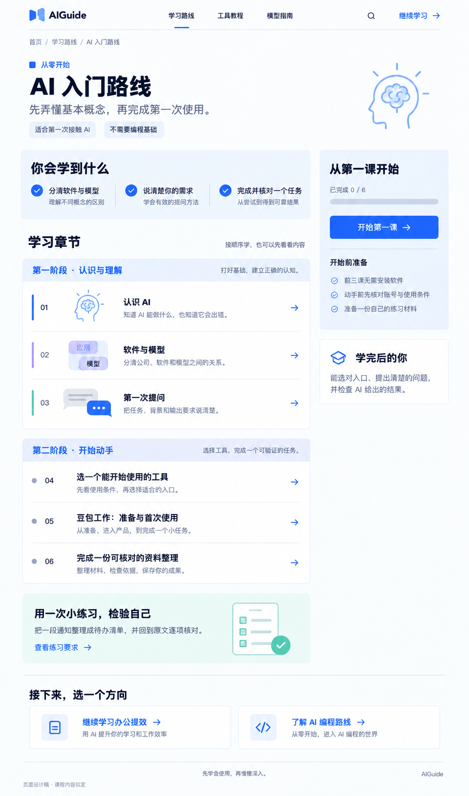
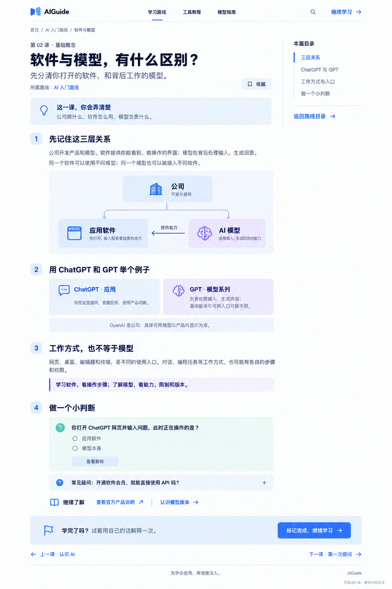
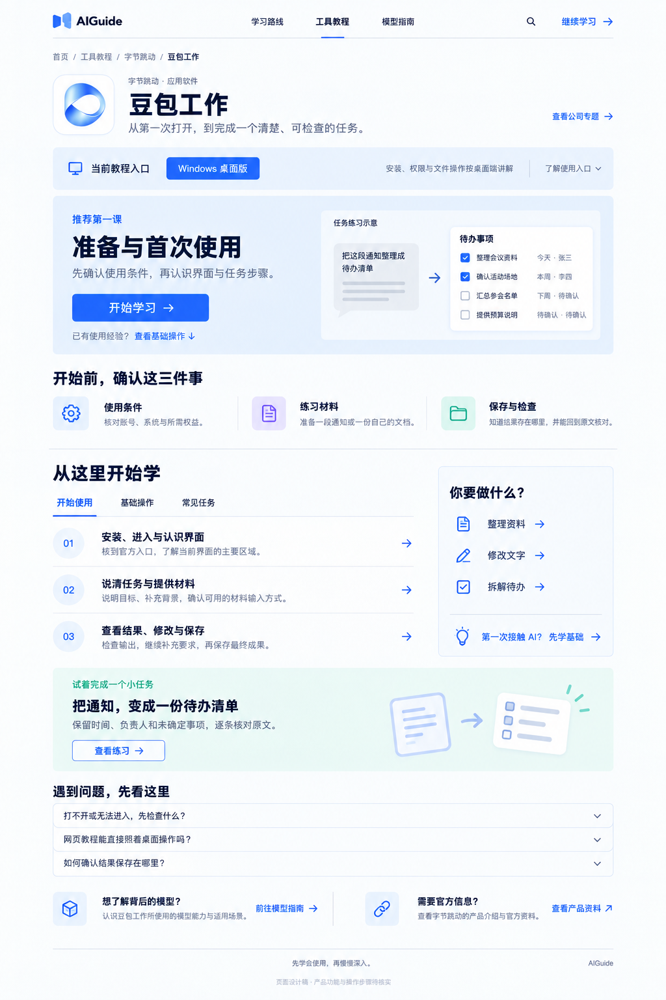

# AIGuide 第一批内页 UI V1

日期：2026-09-13。

按用户指定顺序绘制：路线详情 → 教程正文 → 产品学习页。三张均为内置 image_gen 生成的完整桌面静态设计稿，沿用已选首页的蓝白风格、书页 Logo 和课程图示。

## 01 路线详情

[查看原图](aiguide-route-detail-v1.png)

- 页面回答“从哪里开始、接下来学什么”。
- 六课分为“认识与理解”和“开始动手”两阶段；前三课与首页对应。
- 右侧集中展示开始按钮、准备条件与学完成果。
- 采用首次进入状态，进度为 0 / 6；课程与练习属于拟定内容。
- 原图尺寸：964 × 1632。

## 02 教程正文

[查看原图](aiguide-tutorial-reader-v1.png)

- 页面回答“这一课要理解什么、怎样判断自己学会了”。
- 以“软件与模型，有什么区别？”为例，正文按关系图、实际例子、工作方式与小练习展开。
- 右侧为本篇目录；文末连接当前路线的上一课和下一课。
- 图中的软件窗口、脑部和气泡是概念示意，不是产品界面截图。
- 原图尺寸：1024 × 1536。

## 03 产品学习页

[查看原图](aiguide-product-doubao-work-v1.png)

- 页面回答“我正在学什么软件、什么入口、第一步是什么”。
- 以豆包工作 Windows 桌面版为内容样例，组织准备、基础操作、任务练习与常见问题。
- 应用图标参考来自本机桌面快捷方式指向的 `B:/Support/DoubaoWork/icon.ico`；直接提取 ICO 内置的 256 × 256 PNG，未重画图标。保存为 [本地图标参考](doubao-work-local-icon-reference.png)。
- 本轮确认了快捷方式与安装文件存在，未启动软件验证登录、权限、功能或账号权益。具体课程操作仍需实测。
- 产品区的任务图明确标注为“任务练习示意”，不作为真实产品截图。
- 原图尺寸：1024 × 1536。

## 交付范围

这三张用于审阅内容层次与桌面视觉。未修改网站源码，未执行浏览器交互、响应式或产品实测；图片中的按钮、进度与题目属于设计状态。

[实际生成提示词](aiguide-inner-pages-v1-20260913.prompt.md) · [全站内容蓝图](site-content-blueprint-v1.md) · [已选首页](aiguide-pages-v3-home.png)

原始生成文件保留在 Codex generated_images 目录，项目保存独立副本。

## 原始生成记录

三张原始文件均在 `C:/Users/Yueyu/.codex/generated_images/01a076fd-b82f-74e1-a6b6-61ef9d5188bd/`：

- 路线详情：`exec-09ca3863-0799-42a4-ac96-831a43006647.png`。
- 教程正文：`exec-014bd702-1d76-4246-b866-ebc994830902.png`。
- 产品学习页：`exec-1298a508-2307-4cf0-b717-83ca2cdf7d87.png`。

已逐张目视检查主要标题、内容层次、页面首尾与示意图，并确认项目内图片与说明链接存在。图片中的小字和图形仍应在后续实现时以可编辑文本及原始品牌资产落地。
