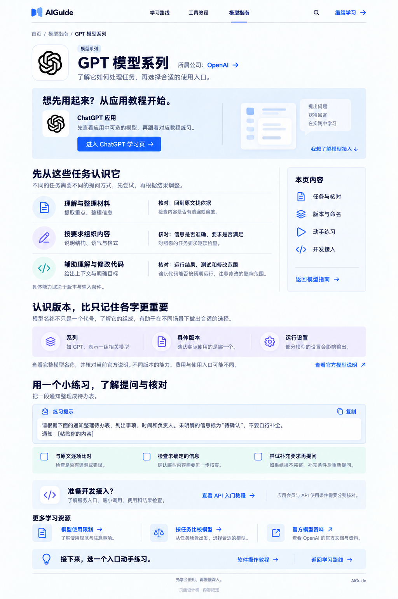
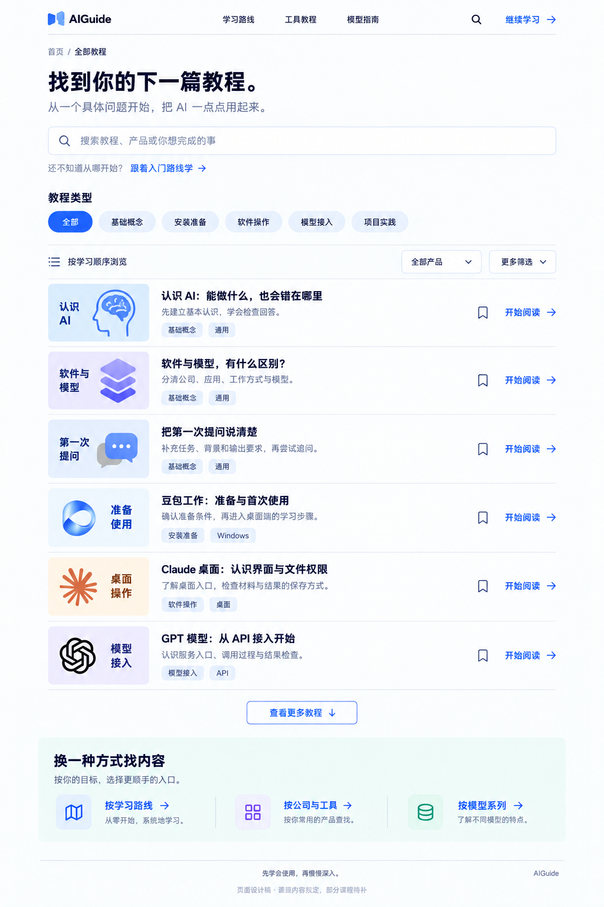

# AIGuide 第三批内页 UI V1

日期：2026-09-14。

本批以“模型指南 → 模型学习页 → 全部教程”补齐认识模型、选择入口和查找课程的流程。三张完整桌面静态稿均使用内置 image_gen，沿用现有蓝白视觉、书页 Logo 与品牌原色参考资产。

## 01 模型指南

[查看完整原图](aiguide-model-guide-v1.png)

先提供基础学习入口，再解释三个关键问题：模型与软件的区别、怎样读懂模型信息、如何按任务选择。下方按公司介绍模型系列，连接模型排名与相关教程。此页承担知识导航，不把排名表或软件目录重复搬进来。

## 02 模型学习页

[查看完整原图](aiguide-model-detail-gpt-v1.png)

以 GPT 模型系列为例，介绍常见学习任务、结果核对方法、版本概念与一次提问练习。普通使用者进入 ChatGPT 学习页，开发者进入 API 接入教程；模型介绍与实际软件操作继续分开。

没有填入未经核实的当前版本、能力分数、价格或权益。应用中的示意图是概念图，不是 ChatGPT 实拍界面。

## 03 全部教程

[查看完整原图](aiguide-tutorial-catalog-v1.png)

用搜索、教程类型与产品筛选找到内容。每行包含独立中文封面、标题、学习目标、教程类型和适用入口。目录样例覆盖基础概念、安装准备、桌面操作与模型接入，避免所有课程只更换名称、共用相同内容。

课程标题与摘要属于内容设计，其中新规划的豆包工作等课程还需补写、实测。页面没有虚构阅读量、时长、完成进度或教程总数。

## 交付范围

已绘制的页面用于桌面视觉与内容组织审阅。未修改网站源码，未进行实际网页交互或响应式验收，未将图片中的操作示意视为产品实测。

[生成提示词](aiguide-knowledge-pages-v1-20260914.prompt.md) · [全站设计目录](design-index.md) · [内容蓝图](site-content-blueprint-v1.md)

## 原始生成记录

三张已逐张目视检查主要标题、版式、品牌配色、课程类型与页面首尾；项目内原图和文档链接已检查存在。

原始目录：`C:/Users/Yueyu/.codex/generated_images/01a076fd-b82f-74e1-a6b6-61ef9d5188bd/`，原始文件保留，项目内保存独立副本。

- 模型指南：`exec-e0d25b3c-b4e9-497b-aaf7-b20bbe0034f1.png`，946 × 1663。
- GPT 模型学习页：`exec-cc4dd746-87aa-469b-ba11-530e29c1a353.png`，1024 × 1536。
- 全部教程：`exec-dc2fbe92-664e-4f7a-8a4c-7d81a0bc8356.png`，1024 × 1536。
