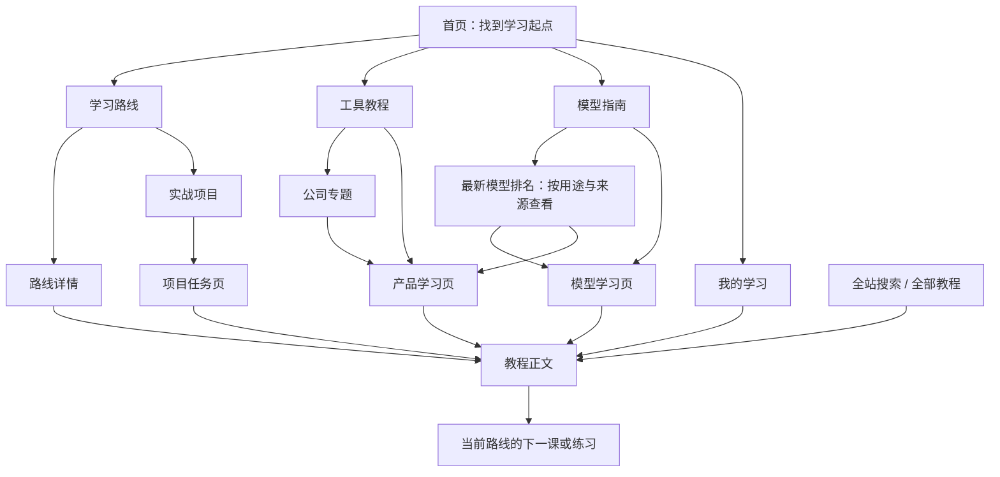

# AIGuide 全站内容与页面蓝图 V1

日期：2026-09-13\
阶段：先确定内容板块、阅读顺序与页面关系，再绘制其余页面的完整 UI。\
本轮成果是内容设计方案，尚未修改网站代码。首页视觉参考为 [当前完整首页](aiguide-pages-v3-home.png)。

## 一、网站要帮助用户完成什么

AIGuide 是面向中文用户的 AI 学习网站。第一次访问的人能够找到明确起点，已经会用的人能够找到具体工具和操作教程，想继续深入的人能够理解模型并动手完成项目。

每个页面只设一个最重要的行动，并回答：

1. 这里能学什么？
2. 我是否具备开始条件？
3. 第一步在哪里？
4. 怎么知道自己学会了？
5. 完成后去哪里？

推荐路径按上手条件与学习目标决定，品牌知名度只是辅助参考。国内新手路线以豆包工作作为拟优先内容；正式推荐前需要补齐它的使用条件和实际操作教程。

## 二、全站导航

页头保持简单：书页 Logo 返回首页；主导航为 **学习路线 / 工具教程 / 模型指南**；右侧为搜索和继续学习。

- 学习路线：入门、办公提效、AI 编程、模型接入；实战项目从这里进入。
- 工具教程：按公司组织工具，也能按用途和使用端找到教程。
- 模型指南：认识模型、最新模型排名、按需选择、具体模型系列；排名拥有独立页面，保持页头三个主入口。
- 继续学习：有记录时回到上次学习内容；无记录时显示“我的学习”，提供开始第一课入口。
- 全部教程和公司专题是站内页面，不继续增加同级主导航。
- 手机端收进菜单，保留搜索和继续学习；功能名称与桌面一致。

公司分组是组织方式。用户可从公司区块中的产品入口直接进入产品学习页，不必每次经过公司专题。

## 三、首页之外的页面与内容顺序

下表共有 14 种内页，其中列表与详情是不同页面；它们归入 8 组内容，不代表页头需要 14 个入口。最新模型排名归入模型指南。

| 页面 | 首屏：先看到什么 | 向下展开的内容板块 | 主要行动 |
| --- | --- | --- | --- |
| 学习路线总览 | 一条明确推荐的入门路线、适合谁、能学到什么 | 其他目标路线；每条路线的准备条件、阶段和学习成果；实战入口 | 查看适合自己的路线 |
| 路线详情 | 路线标题、适用人群、学完成果、开始条件、开始/继续按钮 | 章节目录；当前进度；必要的工具准备；阶段练习；学完后的去向 | 开始第一课或继续下一课 |
| 工具教程目录 | 搜索、按公司浏览、国内新手入口 | 公司分组内的软件与工作方式；使用端筛选；产品对应的起步课程 | 打开一个产品的学习页 |
| 公司专题 | 官方品牌标识、一句话说明、旗下产品关系 | 应用软件；工作模式与编程工具；模型系列；推荐起点；官方入口 | 找到具体产品或模型 |
| 产品学习页 | 产品名称、用途、当前所选使用端、推荐第一课、必要条件 | 平台和工作方式切换；安装准备；基础操作；典型任务；常见问题；相关模型与官方资料 | 学习当前入口的第一课 |
| 模型指南总览 | “模型与软件有什么区别”的短说明、基础学习与最新排名入口 | 认识模型、按任务选模型、了解限制；按公司组织的模型系列；对照方法 | 从一个知识主题、榜单或模型系列开始 |
| 最新模型排名 | 页面标题、用途切换、当前榜单来源与数据日期 | 模型排名列表；任务表现解读；可用软件与对应教程；评测方法和更新记录 | 找到适合任务的模型并进入使用教程 |
| 模型学习页 | 模型系列名称、所属公司、适合哪些任务 | 能力与局限；在哪些应用中使用；版本信息；提示方式；模型对照；进阶接入内容 | 阅读基础介绍或进入可用应用教程 |
| 全部教程 | 搜索框、教程类型、少量常用筛选 | 按公司/产品/使用端筛选；课程摘要和前提；推荐顺序；筛选结果 | 找到并打开一篇教程 |
| 教程正文 | 清楚的课程标题、适用产品与入口、学习目标、准备条件 | 按课程类型组织的步骤或概念；中文图示；练习；检查结果；常见问题；资料；下一课 | 完成练习并继续学习 |
| 实战项目总览 | 作品示例、学习成果、所需基础 | 可做项目；使用工具与条件；成果清单；相关路线 | 查看一个项目任务 |
| 项目任务页 | 最终成果预览、完成要求、开始条件 | 准备材料；阶段任务；对应教程；可复用材料；验收清单；复盘 | 从项目第一阶段开始 |
| 我的学习 | 上次读到哪里、继续按钮 | 当前路线；最近阅读；收藏；已完成；学习记录导入导出 | 继续上次内容 |
| 搜索结果 | 查询词、结果类型和清除/修改搜索 | 教程、工具、模型、路线的分组结果；匹配说明；没有结果时的建议 | 进入最匹配的内容 |

404、空记录、无搜索结果、暂缺某平台教程等作为状态设计，不新增一套内容分类。

## 四、重点页面的具体板块

### 1. 学习路线总览：帮助选择

**布局顺序**

1. 页面标题“找到适合你的 AI 学习路线”。
2. 入门推荐区：对象、三个基础章节、开始后的实际成果。
3. 其他路线列表：办公提效、AI 编程、模型接入。
4. 每条路线显示“适合谁 / 需要什么基础 / 最后能做什么”。课时和时长由正式章节汇总，不在设计图里编造。
5. 页面底部关联实战项目。

保留首页三色卡片的亲和感，但总览中的每条路线采用便于比较的摘要，不重复完整教程正文。

### 2. 路线详情：让用户知道下一步

**桌面布局**：主栏为章节和阶段任务，右侧窄栏显示准备条件、当前进度和继续按钮。\
**手机布局**：准备条件在开始按钮之前，章节单列；底部轻量固定继续按钮。

**拟定的零基础路线**

| 顺序 | 章节 | 实际内容 | 当前素材情况 |
| --- | --- | --- | --- |
| 01 | 认识 AI | 它能帮你做哪些事、容易错在哪里、如何核对 | 已有基础文章，需按本章目标拆分改写 |
| 02 | 软件与模型 | 公司、应用、工作方式与模型的关系，用少量真实例子解释 | 已有三层概念文章，需调整面向小白的表达 |
| 03 | 第一次提问 | 说清任务、背景和输出要求；做一次追问与核对 | 已有提示词内容，需拆出最简单的起步课 |
| 04 | 选一个能开始使用的工具 | 核对可用入口、系统与账号条件，再选择教程 | 待新增入门选择内容 |
| 05 | 豆包工作：准备与首次使用 | 对应系统的准备、进入软件、认识界面、完成一个小任务 | 当前内容库尚无独立产品与教程，待补 |
| 06 | 完成一份可核对的资料整理 | 输入材料、得到结果、检查依据、保存成果 | 可借鉴现有资料整理方法，产品操作需另行写作与实测 |

前三章必须与首页三张卡片逐一对应。新章节未准备好之前，不把首页按钮接到空白内容。

**AI 编程路线**

先检查账号、网络可达性、系统支持和所需权益，再准备工作目录、进入具体 Codex 使用方式，最后完成并检查一个小项目。准备条件不满足时，提供已核实的可用替代入口，不把全部新手默认带入 Codex。

**下一课规则**

同一教程可能属于多个路线。下一课依据用户当前进入的路线决定；从搜索进入时提供相关内容，不擅自认定用户已经加入某条路线。

### 3. 工具教程目录：按公司找、直接进入产品

首屏内容为页面标题、搜索框和一条新手引导，不放密集排行榜。

每家公司作为一个分组，显示原色品牌标识、产品名称和简短用途。公司名称可进入公司专题，产品名称直接进入产品学习页。

**每个产品条目的必要字段**

- 产品名称与官方标识。
- 它是什么：应用、工作方式或编程工具。
- 适合做什么：一句话。
- 支持的使用入口：网页、桌面、编辑器、终端等，按实际支持情况提供。
- 一篇最适合开始的教程。
- 必要时显示付费或准备条件。

这里以软件与工作方式为主。模型的解释和选择集中到模型指南；需要说明关系时给出相关链接。

### 4. 公司专题：聚合品牌，解释关系

公司页负责解释“这家公司有哪些东西，它们有什么关系”，内容顺序为：

1. 公司标识、公司名、简短说明。
2. “从哪里开始”：推荐一个适合新手的产品入口。
3. 应用软件。
4. 工作方式与编程工具。
5. 模型系列。
6. 官方资料。

OpenAI、Anthropic、Google、字节跳动等各自集中呈现。产品合并安装、内嵌工作方式与账号权益等关系，按更新时的官方资料维护；不能把公司归组等同于所有产品操作都相同。

模型系列和软件即使同名也带明确类别。公司图标和产品图标使用各自实际资产，保留品牌颜色。

### 5. 产品学习页：按实际入口组织教程

**例：一个桌面 AI 应用的学习页**

1. 产品是什么、适合完成什么。
2. 使用入口选择：仅显示实际提供的网页、Windows、macOS、编辑器或终端入口。
3. 当前入口的准备条件：系统、账号与必要权益；网络条件在需要时说明。
4. 推荐第一课。
5. 安装与开始使用。
6. 日常操作。
7. 常见任务。
8. 常见问题。
9. 相关工作方式、模型与官方资料。

切换入口后，准备条件、课程、截图和故障处理随之切换。不能把网页正文原样复用到桌面端。

**课程差异举例**

| 内容 | 网页教程重点 | 桌面教程重点 |
| --- | --- | --- |
| 开始使用 | 官方网址、登录、浏览器中的入口 | 官方安装来源、支持的系统、安装与启动 |
| 输入材料 | 粘贴内容、网页支持的上传方式 | 当前版本支持的文件选择、目录或系统权限 |
| 认识界面 | 网页侧栏、输入区、功能入口 | 桌面导航、任务区、系统功能入口 |
| 得到结果 | 查看、复制或下载结果 | 查看结果及其真实保存位置 |
| 遇到问题 | 页面、浏览器权限、上传与连接问题 | 系统兼容、启动、文件权限与保存问题 |

工作模式再作为产品内部的独立学习分组。是否共享安装程序、哪些模式可用，不能只凭名称推断。

### 6. 模型指南与模型学习页：解释能力和边界

**模型指南总览**

顶部为简短引导：“先理解模型，再按需要选择”。提供认识模型、最新模型排名、按需选择三个清楚的入口，下方是按公司分组的模型系列。入门路线仍先学习基本概念，排名供有明确选择需求的人进入。

**最新模型排名：独立内容页面**

本页帮助用户理解“在什么任务和评测条件下表现好、我在哪里能用、如何开始学”。榜单必须能连接到具体模型介绍、可用产品和对应教程。

首屏采用简洁标题区与列表，不堆叠领奖台、大数字和多张统计卡。页面文案为：

- 标题：最新模型排名。
- 说明：看懂模型表现，找到适合你的选择。
- 用途：综合能力 / 编程 / 中文表达 / 图像 / 视频。分类是内容规划；取得可核验的对应评测后才开放，没有依据的类别不填入示例名次。
- 来源与日期：紧邻榜单显示当前评测名称、评测范围和源数据日期；展开后查看本站核对时间、原始页面与评测方法。

| 顺序 | 内容板块 | 信息与交互 |
| --- | --- | --- |
| 01 | 用途与榜单来源 | 先选用途，再选该用途下的独立榜单；默认只展示一套评测结果，切换来源同时切换指标与说明 |
| 02 | 最新排名列表 | 来源名次、官方原色图标、模型完整版本名与公司、该来源的原始分数及单位、查看详情入口 |
| 03 | 模型展开详情 | 该评测说明了什么、主要限制、对应版本、可在哪些应用使用；有依据时附同来源的速度和费用资料 |
| 04 | 从这里开始用 | 根据使用条件提供一个起步教程；网页、桌面或 API 入口分别标注，有多个入口时由用户选择 |
| 05 | 怎么看这份排名 | 用简短中文解释评测任务、样本或运行条件、并列与不确定性，链接原始方法 |
| 06 | 数据与更新记录 | 源数据日期、本站最后成功核对时间、变化摘要；没有可比历史快照就不显示升降箭头 |

**排序与公司组织**

- 默认保留当前来源的原始排名与并列方式。按公司筛选后仍显示来源名次，不把“来源第 8”改成“世界第 1”。
- 公司筛选和详情把旗下模型聚合呈现；排名行保留具体模型版本，不能用整家公司代替某个模型成绩。
- 模型排名与应用、Agent 产品评价分别组织。软件任务系统的成绩只有在运行条件明确时才能解释为该系统的表现，不能直接计入基础模型总分。
- “综合能力”只能使用有公开方法的某一来源综合指标。不同来源的分数并列说明，不相加、平均或重新包装成本站权威总分。
- “适合新手”“国内使用条件”“API 成本”属于选用信息，与性能名次分开。国内可用性按具体产品入口和核实条件记录，不能由公司所在地推断。

**来源候选与更新边界**

Arena、Artificial Analysis 可作为待核实的来源候选；编程任务可评估 SWE-bench 等公开评测是否适合展示。实际接入前核对页面、数据取得方式、允许使用范围、评测版本与更新状态。本轮仅设计板块，未核实这些来源的当前榜单，未填写任何实时名次。

“最新”指本页最后成功核对的公开快照。源站没有提供更新日期时明确写“源站未注明”，不拿本站核对时间替代；不能用打开页面的当天日期制造新鲜感。更新失败时保留上一份数据及其日期，并显示“更新暂未成功”。只有确认存在持续更新机制后才使用“自动更新”等表述。

首版可按已核实的快照整理内容；计划中的更新机制不表示已经实现或启用。不自动创建定时任务。

**版式与手机端**

桌面默认显示简洁列表，分数旁可展开解释；高级筛选折叠。手机将每行转换成紧凑纵向条目，保持来源、名次、模型版本和学习入口可读，避免把宽表整体缩小。图标沿用官方配色，状态用文字表达，不仅依赖颜色。

**具体模型学习页**

1. 一句话认识该模型系列。
2. 常见适用任务与主要限制。
3. 普通用户可以在哪些应用里使用它。
4. 模型版本及区别：注明来源与核对时间。
5. 相应的提问和输出核对方法。
6. 同类模型对照：说明任务、条件和证据，不编造统一评分。
7. 进阶内容：API 入口、调用流程、费用资料、常见错误。
8. 相关教程与官方文档。

“直接使用”和“开发接入”分开呈现。API 细节不占据小白用户的第一屏。价格、额度和支持范围使用核实后的内容；未维护实时数据时提供官方入口。

### 7. 全部教程与教程正文：页面骨架可以一致，教学方式要不同

**全部教程**

常用筛选保留“教程类型”和“产品”，更多筛选收起。筛选条件可清除，返回列表时保留位置和条件。公司及产品别名都能用于查找。

教程封面使用中文说明；实际软件界面若是英文，保留真实界面并增加中文标注。生成的操作示意明确标为“示意”，不伪装成软件实拍。

**正文共同部分**

标题 → 适用产品与入口 → 学习目标 → 准备条件 → 主体教学 → 练习与核对 → 官方资料 → 下一课。

正文以阅读为主：桌面正文约 680–760px 宽，右侧为本篇目录；手机目录折叠，正文单列。首页的大卡片不直接搬进正文。

**按教学内容选择主体板块**

| 正文类型 | 主体板块 | 学完的判断 |
| --- | --- | --- |
| 基础概念 | 简短解释 → 图示关系 → 真实例子 → 常见误解 → 小练习 | 能辨认概念并解释一个例子 |
| 安装准备 | 当前系统 → 准备条件 → 官方安装步骤 → 入口定位 → 启动检查 → 对应问题 | 能进入所需的正确软件/模式 |
| 软件操作 | 输入材料 → 操作位置 → 分步截图 → 预期结果 → 本步检查 → 修改或重试 | 能独立得到并核对结果 |
| 模型/API 接入 | 适用能力 → 服务准备 → 最小调用 → 输入输出解释 → 错误与费用处理 → 结果校验 | 能说明调用过程并检查返回结果 |
| 项目实践 | 成果样例 → 阶段任务 → 相关教程 → 检查点 → 成果验收 → 复盘 | 完成明确的作品与验收项 |

不是每篇教程都必须有提示词框或代码框：只有内容需要时才出现。复制成功、展开截图、勾选练习和下一课入口都属于后续 UI 的明确状态。

### 8. 实战项目：学完之后做什么

**项目总览**

每个项目显示中文成果预览、最终交付物、所需基础、工具与条件、关联路线。可先沿用现有个人主页、研究笔记、周报工作流三个题材。

**项目任务页**

1. 最终成果与示例。
2. 完成要求。
3. 准备材料。
4. 阶段任务；每个阶段直接关联所需课程。
5. 可复制的任务说明或模板。
6. 验收清单。
7. 复盘问题与下一步学习。

作品需要用户在对应工具中完成；页面不表现成站内自动生成器。阅读任务不等于完成项目。

### 9. 我的学习：让用户能回来继续

将“继续学习”放在最前面，接着展示当前路线、最近阅读、收藏和已完成。数据来自实际记录。

无学习记录时，推荐入门第一课；无收藏时说明如何收藏。首版沿用当前浏览器本地记录，并在导入导出附近说明保存位置。

学习记录导入后显示合并结果；不设计不存在的跨设备同步、账户权益或虚构学习时长。

### 10. 搜索：同名软件和模型也要找得到

查询“Claude”“豆包”等名称时，结果按“工具 / 模型 / 教程 / 路线”区分，名称下显示使用端或内容类型，避免点击前无法判断。

优先显示最直接匹配的内容。支持公司、产品别名和任务用途；零结果时建议修改关键词或清除条件。搜索框有最近查询时才展示历史，不填造热门数据。

## 五、同一套视觉语言，不同页面的版式

| 页面场景 | 合适的组织方式 | 应保留的特点 |
| --- | --- | --- |
| 首页与路线入门 | 三色图文卡片、简短引导 | 用户已明确喜欢的脑部、分层和填充气泡插图 |
| 目录与公司分组 | 规则列表或适量产品卡片 | 公司聚合、官方原色图标、容易比较 |
| 产品学习页 | 产品介绍 + 使用端选择 + 阶段课程 | 网页/桌面/工作方式的实际区别 |
| 模型知识页 | 概念说明、示意关系、条件对照 | 不把模型包装成桌面软件 |
| 最新模型排名 | 用途切换 + 来源说明 + 排名列表 + 教程入口 | 指标可追溯、日期明确、具体模型版本可辨认 |
| 教程阅读页 | 阅读正文 + 本篇目录 + 练习 | 中文易读、截图能看清、下一步明确 |
| 项目任务页 | 成果预览 + 阶段清单 + 验收 | 能看到自己最后要做出什么 |
| 我的学习 | 最近内容与进度列表 | 轻量、可继续、不像数据仪表盘 |

蓝、紫、薄荷绿用于首页和课程视觉区分，不擅自赋予“紫色都代表模型”等全站业务含义。状态和类别同时用文字表达。品牌图标继续使用官方配色。

## 六、全站共同状态与手机规则

| 状态或场景 | 页面应如何处理 |
| --- | --- |
| 从未学习 | 显示入门起点，不显示假进度 |
| 正在学习 | 标出当前章节，继续按钮进入该章节 |
| 已完成 | 提供复习和下一步；完成状态允许撤销 |
| 当前平台没有教程 | 说明支持的入口，推荐确实存在的内容 |
| 搜索/筛选无结果 | 显示已选条件与清除入口 |
| 找不到旧链接 | 给出相关目录和可恢复入口 |
| 截图或资料暂缺 | 内容生产阶段标待补，正式页面不展示伪造截图 |
| 榜单暂无可核实数据 | 展示来源说明和模型知识入口，不填入虚构名次 |
| 榜单更新失败 | 保留上次成功快照和日期，明确提示状态 |
| 手机页头 | 折叠菜单，保留搜索和继续学习 |
| 手机目录 | 筛选折叠，卡片单列，产品使用端选项保持可见 |
| 手机正文 | 目录折叠，图片可放大，表格有独立滚动容器 |
| 键盘操作 | 焦点清楚，弹层可关闭，主操作可通过键盘到达 |
| 动效 | 只辅助状态变化，尊重减少动态效果的系统设置 |

## 七、内容生产前必须补齐的资料

### 统一的内容字段

- 公司：名称、别名、官方品牌资产、旗下产品关系。
- 产品：产品名、所属公司、用途、使用端与工作方式、准备条件、官方入口。
- 模型：系列、版本、任务适用性、限制、可使用的应用、开发入口与资料来源。
- 榜单：用途、来源名称与链接、评测版本和条件、指标名称与单位、源数据日期、本站核对时间、快照记录；条目包含完整模型版本、原始名次/并列、分数及来源提供的不确定性信息。
- 教程：唯一标识、类型、产品与使用端、目标、前提、分步内容、截图/示意、练习和来源。
- 路线：适用人群、前提、章节顺序、可替代分支、最终成果。
- 项目：任务说明、材料、阶段、相关课程、成果与验收清单。

### 来源与版本

“内容整理时间”“官方文档核对时间”“实际操作验证时间”分别记录。不能把修改文章的日期当成已实测。

发布具体产品教程前，核对所用系统、应用版本和账号条件。公司关系或模式变化时，修订对应入口和教程，不靠全站统一文案掩盖差异。

### 本轮检查到的现状

2026-09-13 直接加载当前项目内容模块得到：37 篇教程、30 个产品/模型条目、12 家公司、4 条路线、3 个项目。其中条目为应用 11、agent 类 9、模型 10。这些数量表示仓库里有内容，不代表每项已实测。

| 问题 | 证据与影响 | 内容设计决定 |
| --- | --- | --- |
| 首页三步与实际路线不完全对应 | starter 当前依次为 ai-first、choose-model、prompt-template、chatgpt-files | 重新编排三篇基础课，并补齐国内入门产品环节 |
| 豆包工作不在内容库 | 字节跳动目前只有 doubao 与 doubao-models | 新增独立产品、准备教程与首次任务内容 |
| 模型和软件共用详情结构 | ToolDetail 同时处理 app、agent、model | 模型有独立内容结构，产品页按使用入口教学 |
| 正文按首个匹配路线计算下一课 | Reader 使用第一个包含该课程的路线 | 后续实现需要保留用户当前路线来源 |
| 部分路线封面还使用英文标题 | Paths 使用 START HERE 等封面文案 | 新内页统一中文标题与中文操作标注 |
| 已选首页视觉尚未应用到源码 | 目前设计稿在 docs/ui-redesign，Shell 仍为旧导航 | 先完成全站内容与视觉稿，再统一改版 |
| 旧排名原型使用编辑综合分 | model-ranking-ui-prototype/index.html 含多来源与编辑判断的归一化评分，属于静态原型内容 | 可参考浏览结构；当前名次、分数与版本需要逐项重新核实，不直接迁入最新模型排名 |

以上只做了源代码与内容数据检查，本轮未重新验证第三方产品的当前功能和安装流程。

## 八、后续 UI 出图顺序

内容蓝图是下一轮绘图依据；按用户的“先设计好内容板块”要求，本轮先交付结构方案。

1. **先闭合学习流程**：路线详情 → 教程正文 → 产品学习页。分别使用“零基础路线”“软件与模型基础课”“豆包工作学习页”的具体内容；尚缺内容标为设计样例与待补。
2. **再统一发现入口**：工具目录 → 公司专题 → 模型指南 → 最新模型排名 → 模型详情 → 全部教程与搜索。排名页无核实数据时先画明确标注的结构示意，不用真实品牌配虚构成绩。
3. **最后补齐学习管理**：实战项目总览/任务页 → 我的学习 → 空状态与手机布局。

每个页面使用真实的拟定标题、内容板块和去向绘制完整 UI；不是拿同一张卡片模板换名字。后续落地尽量保留现有有效链接和学习记录，新增模型视图与搜索入口的路由在实施时明确映射。

第一批内页桌面视觉稿见 [路线详情、教程正文与产品学习页 V1](aiguide-inner-pages-v1-20260913.md)。设计稿不表示教程内容已完成实测或网站已落地。

第二批桌面视觉稿见 [工具目录、公司专题与模型排名 V1](aiguide-discovery-pages-v1-20260913.md)。排名稿仅展示结构与学习入口，名次、分数和版本等待来源核实后填入。

第三批桌面视觉稿见 [模型指南、模型学习页与全部教程 V1](aiguide-knowledge-pages-v1-20260914.md)。全部已有稿件与未完成页面统一列于 [全站设计目录](design-index.md)。

第四批见 [路线总览、搜索、实战项目与我的学习 V1](aiguide-completion-pages-v1-20260914.md)。截至 2026-09-14，首页与本蓝图的 14 种内页均已有桌面初稿，移动端、交互状态、内容核对与网站实现仍需继续。

第五批见 [手机端与关键状态 V1](aiguide-mobile-pages-v1-20260914.md)：5 张方案板、15 个手机画面，覆盖 11 种主页面的代表布局和项目完成、搜索无结果、无学习记录、榜单更新失败等状态。每屏仅展示可见节选；其余手机页面、平板与弹层仍待补充。手机交互、恢复路径和可访问性约定也写入该说明，尚未在网站实现或验证。

第六批见 [剩余手机页、平板与弹层 V1](aiguide-responsive-completion-v1-20260914.md)：补齐模型指南、模型学习、全部教程、正常搜索结果四种手机主页面，新增导航菜单、筛选过程和首页/阅读两种平板代表布局。15 种主页面均已有桌面与手机代表稿。后续进入可点击前端原型，结合长页、交互反馈与剩余边界状态做真实多屏验证；静态稿不能代替浏览器验收。

## 九、现有实现的对应文件

- src/App.jsx：当前页面入口。
- src/pages/Paths.jsx：路线总览与详情。
- src/pages/Company.jsx：公司关系与分组。
- src/pages/Tools.jsx：产品目录与软件/模型共用详情。
- src/pages/Reader.jsx：正文与下一课。
- src/pages/Catalog.jsx：全部教程与筛选。
- src/pages/Projects.jsx：项目总览与任务。
- src/pages/Library.jsx：本地学习记录。
- src/data/catalog.js：路线和项目内容。
- src/data/companies.js、src/data/products.js、src/data/index.js：公司、产品与教程归属。
